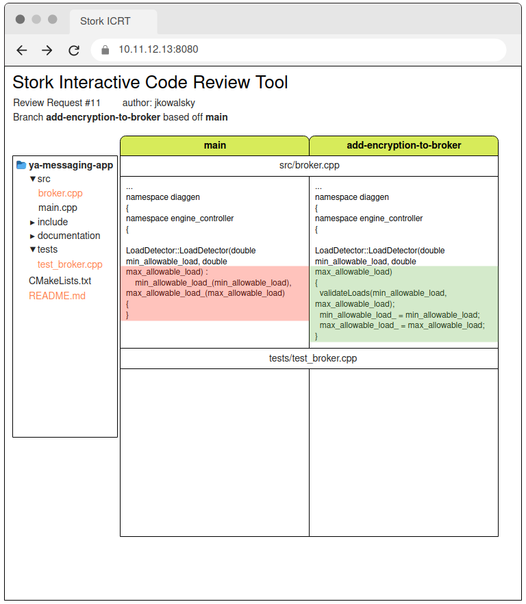

# Reviewer's perspective

## I. How does a Reviewer see an open request

When reviewer starts browsing the changes, the screen is somewhat similar to what other products (GitHub, Bitbucket, Gerrit) offer:

## II. What comes after opening the auxiliary context recorded by the Author